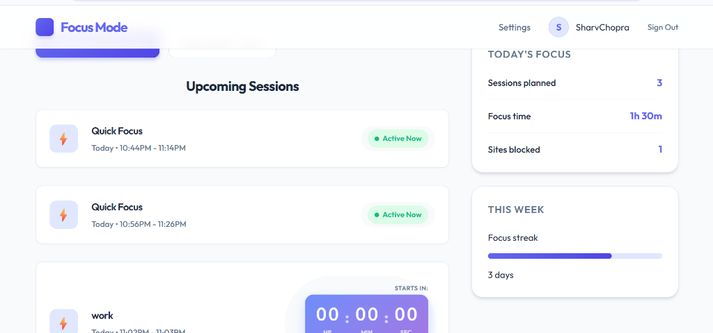
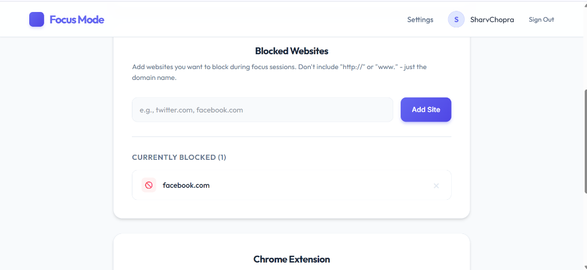
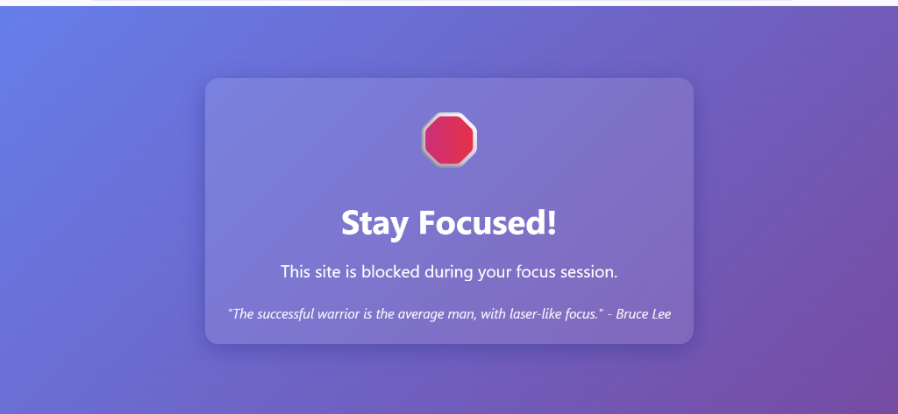

# Focus Mode - Full-Stack Productivity App

<div align="center">
  
  
  <p align="center">
    <strong>Minimize digital distractions. Maximize deep work.</strong>
  </p>

  <p align="center">
    <a href="#key-features">Key Features</a> •
    <a href="#how-it-works">How It Works</a> •
    <a href="#screenshots">Screenshots</a> •
    <a href="#tech-stack">Tech Stack</a> •
    <a href="#local-installation-and-setup">Installation</a>
  </p>
</div>

---

**Focus Mode** is a modern, full-stack web application designed to help you regain control of your attention. It combines a sleek dashboard for planning focused work sessions with a powerful Chrome Extension that enforces your boundaries by blocking distracting websites in real-time.

## 🌟 Key Features

*   **🔐 Secure Authentication**: Seamless and secure login via GitHub (OAuth 2.0).
*   **📅 Session Scheduling**: Plan ahead by scheduling future sessions or launch a **"Quick 30min Focus"** instantly.
*   **🛡️ Real-Time Blocking**: The companion Chrome Extension automatically syncs with your schedule to block distractions.
*   **⛔ Dynamic Blocklist**: You choose what to block. Add or remove sites (e.g., `youtube.com`, `twitter.com`) effortlessly.
*   **🛑 manual Control**: need a break? End sessions early with immediate unblocking.
*   **📊 Insightful Dashboard**: visualize your productivity journey.

## ⚙️ How It Works

<div align="center">
  
</div>

1.  **Log In**: Sign in with your GitHub account.
2.  **Configure**: Add distracting sites to your blocklist in Settings.
3.  **Schedule**: Set a time for deep work or start a quick session.
4.  **Focus**: The extension activates, keeping you away from your blocked sites until the timer runs out.

## 📸 Screenshots

### Dashboard & Analytics
<div align="center">
  
  <p><em>Track your active session and remaining time.</em></p>
</div>

### Landing Page
<div align="center">
  
</div>

### Settings: Manage Blocklist
<div align="center">
  
</div>

### Blocked Page (Enforcement)
<div align="center">
  
  <p><em>What you see when trying to access a blocked site during a session.</em></p>
</div>

## 🛠️ Tech Stack

### Frontend
*   **React** (Vite)
*   **Framer Motion** (Animations)
*   **CSS Modules** (Styling)
*   **Axios** (API Requests)

### Backend
*   **Node.js & Express**
*   **MongoDB & Mongoose** (Database)
*   **Passport.js** (GitHub Authentication)

### Extension
*   **Chrome DeclarativeNetRequest API** (Blocking)
*   **Chrome Alarms API** (Syncing)

## 🚀 Local Installation and Setup

Run the full suit locally: Backend, Frontend, and Extension.

### 1. Backend Setup

```bash
cd focus-mode-server
npm install
```

Create a `.env` file in `focus-mode-server/`:
```env
GITHUB_CLIENT_ID=your_client_id
GITHUB_CLIENT_SECRET=your_client_secret
MONGO_URI=your_mongodb_connection_string
COOKIE_KEY=any_random_secure_string
FRONTEND_URL=http://localhost:5174
```

Start the server:
```bash
node index.js
# Server runs on http://localhost:5000
```

### 2. Frontend Setup

```bash
cd client
npm install
npm run dev
# App runs on http://localhost:5174
```

### 3. Extension Setup

1.  Open Chrome and navigate to `chrome://extensions`.
2.  Toggle **Developer Mode** (top right).
3.  Click **Load Unpacked**.
4.  Select the `extension` folder from this project directory.

## 🤝 Contributing

Contributions are welcome! Please feel free to submit a Pull Request.
