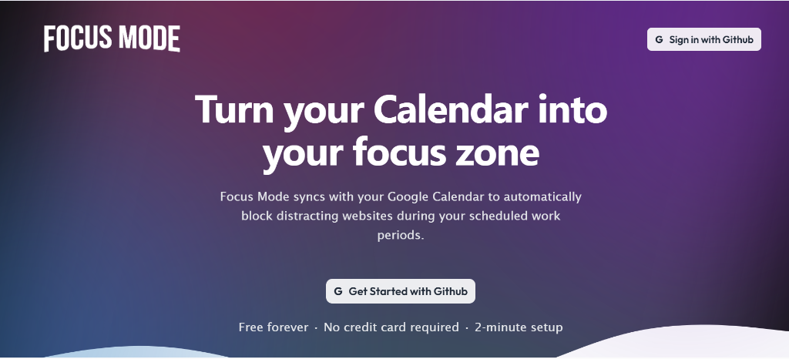
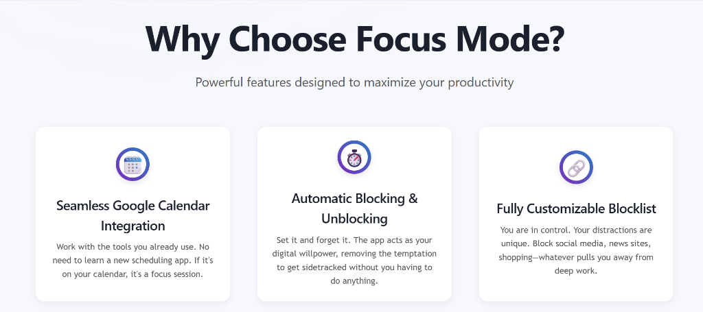
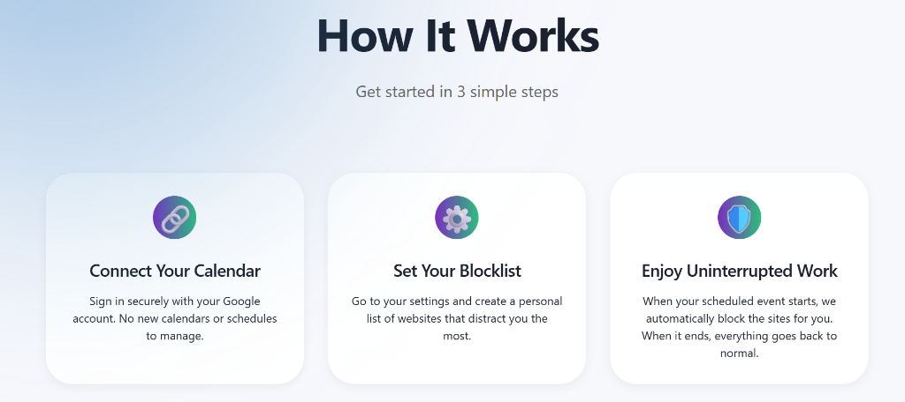
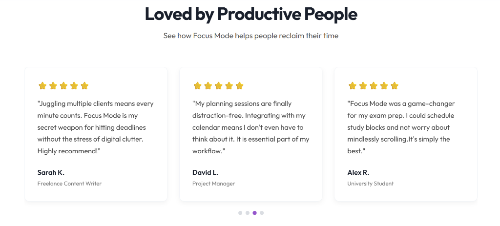
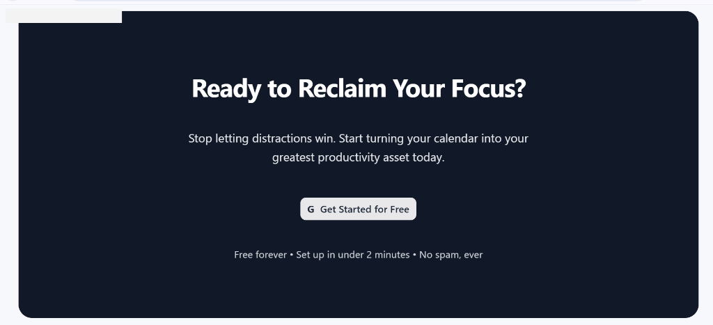

# Focus Mode - Full-Stack Productivity App

Focus Mode is a modern, full-stack web application designed to help users minimize digital distractions and enhance deep work. It allows users to schedule dedicated focus sessions, and uses a companion Chrome Extension to automatically block distracting websites during those periods.



## Key Features

*   **Secure Authentication**: Seamless login with GitHub (OAuth 2.0).
*   **Session Scheduling**: Schedule future focus sessions or start a "Quick 30min Focus" immediately.
*   **Real-Time Blocking**: A Chrome Extension that automatically enforces your blocklist when a session is active.
*   **Dynamic Blocklist**: Customize your own list of distracting sites (e.g., social media, news).
*   **End Session Control**: Manually end sessions early if needed, with immediate unblocking.
*   **Analytics Dashboard**: Track your focus history, total focus time, and streaks.

## Screenshots

### Landing Page & Features


### Focus Workflow


### User Testimonials


### Ready to Focus?


## Tech Stack

*   **Frontend**: React, Vite, Framer Motion, CSS Modules
*   **Backend**: Node.js, Express
*   **Database**: MongoDB, Mongoose
*   **Authentication**: Passport.js (GitHub Strategy)
*   **Extension**: Chrome DeclarativeNetRequest API

## Local Installation

To run this project, you need to start the backend, frontend, and load the extension.

### 1. Backend Setup
```bash
cd focus-mode-server
npm install
```
Create a `.env` file in `focus-mode-server/` with:
```env
GITHUB_CLIENT_ID=your_id
GITHUB_CLIENT_SECRET=your_secret
MONGO_URI=your_mongo_uri
COOKIE_KEY=random_string
FRONTEND_URL=http://localhost:5174
```
Run the server:
```bash
node index.js
# Runs on localhost:5000
```

### 2. Frontend Setup
```bash
cd client
npm install
npm run dev
# Runs on localhost:5174
```

### 3. Extension Setup
1.  Open Chrome and go to `chrome://extensions`.
2.  Enable **Developer Mode**.
3.  Click **Load Unpacked**.
4.  Select the `extension/` folder from this project.

## Usage
1.  Log in with GitHub.
2.  Go to **Settings** to add sites to block (e.g., `youtube.com`).
3.  Go to **Dashboard** and click **"Quick 30min Focus"**.
4.  Try visiting a blocked site—it will be inaccessible until the timer ends!
